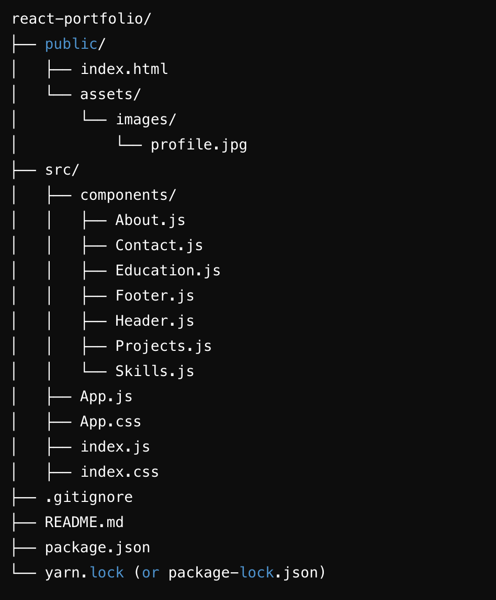

# Md Khalid Mojib - Portfolio 

Welcome to my portfolio! This repository showcases a collection of my projects, skills, and experiences. Here, you'll find details about the work I've done, the technologies I use, and how you can get in touch with me. 

## View Portfolio

You can view the live version of my portfolio [here](https://mk-mojib.github.io/react-portfolio/).


## Table of Contents
- [Home](#home)
- [About](#about-me)
- [Projects](#projects)
- [Qualification](#qualification)
- [Skills](#skills)
- [Contact](#contact)

## About Me

Hi, I'm Md Khalid Mojib, a Front-end Developer with a passion for Software Engineering. I specialize in HTML, CSS, JavaScript, and the MERN stack. With a strong background in web development, I enjoy working on unique and challenging projects.

## Project Structure

()


react-portfolio/
├── public/
│   ├── index.html
│   └── assets/
│       └── images/
│           └── profile.jpg
├── src/
│   ├── components/
│   │   │   └── About.js
│   │   │   ├── Contact.js
│   │   │   ├── Education.js
│   │   │   ├── Footer.js
│   │   │   ├── Header.js
│   │   │   ├── Projects.js
│   │       └── Skills.js
│   ├── App.js
│   ├── App.css
│   ├── index.js
│   ├── index.css
├── .gitignore
├── README.md
├── package.json
└── yarn.lock (or package-lock.json)


## Projects

Here are some of the projects I've worked on:

### WanderLust (https://wanderlust-z0de.onrender.com/listings)
- **Description**: Wanderlust is a web application that allows users to share and explore unique accommodations around the world. Whether it's a
                   cozy home, a luxurious hotel room, or a charming cottage, Wanderlust provides a platform for users to showcase their properties
                   and connect with like-minded travelers.
- **Technologies Used**: HTML, CSS, JavaScript, Express.js, Node.js, MongoDB, Bootstrap.
- **Features**: Have Implemented a full stack project using the MVC Framework
- **Link**: https://github.com/mk-mojib/wanderlust

### Notes App (https://main--mk-notes.netlify.app)
- **Description**: The Note App is a web application designed to help users create, update, delete, and search notes efficiently. It features a user-
                   friendly interface and leverages local storage for data persistence.
- **Technologies Used**: HTML, CSS, React.js, JavaScript, Node.js, Express.js.
- **Features**: Create your notes with 10 unique colorful background.
- **Link**: https://github.com/mk-mojib/Notes-App

### Moshop (https://mk-mojib.github.io/ecommerce-react-app/)
- **Description**: At Moshop, we redefine online shopping, offering a curated collection of the latest trends in men's, women's, and kids'
                   garments. We pride ourselves on being your go-to destination for stylish and affordable fashion.
- **Technologies Used**: HTML, CSS, React.js, JavaScript, Node.js, Express.js.
- **Features**: Add to cart your favorite garments for the consideration.
- **Link**: https://github.com/mk-mojib/ecommerce-react-app

## Skills

- **Programming Languages**: C/C++, Core Java, Python, JavaScript, HTML, CSS, MERN Stack
- **Frameworks & Libraries**: React.js, Express.js, Node.js, JavaScript, Git, Bootstrap, Tailwind CSS, Docker, HTML5, CSS3
- **Database & Storage**: MongoDB, Firebase, MySQL
- **Tools & Technologies**: AWS, Render.com, MongoDB Atlas, Github Page, Netlify.
- **Design**: UI/UX Design

## Contact

Feel free to reach out to me through any of the following channels:

- **Email**: mdkhalidmojib2001@gmail.com
- **LinkedIn**: https://www.linkedin.com/in/mdkhalidmojib/
- **Twitter**: https://x.com/MKMOJIB1
- **GitHub**: https://github.com/mk-mojib/

## License

This portfolio is licensed under the Md Khalid Mojib License.

## Installation

 # Clone the repository
git clone https://github.com/mk-mojib/my-portfolio.git

# Navigate to the project folder
cd my-portfolio

# Install dependencies
npm install

# Run the development server
npm start


## Usage

To run the project, use the following command:

```bash
$ npm start

